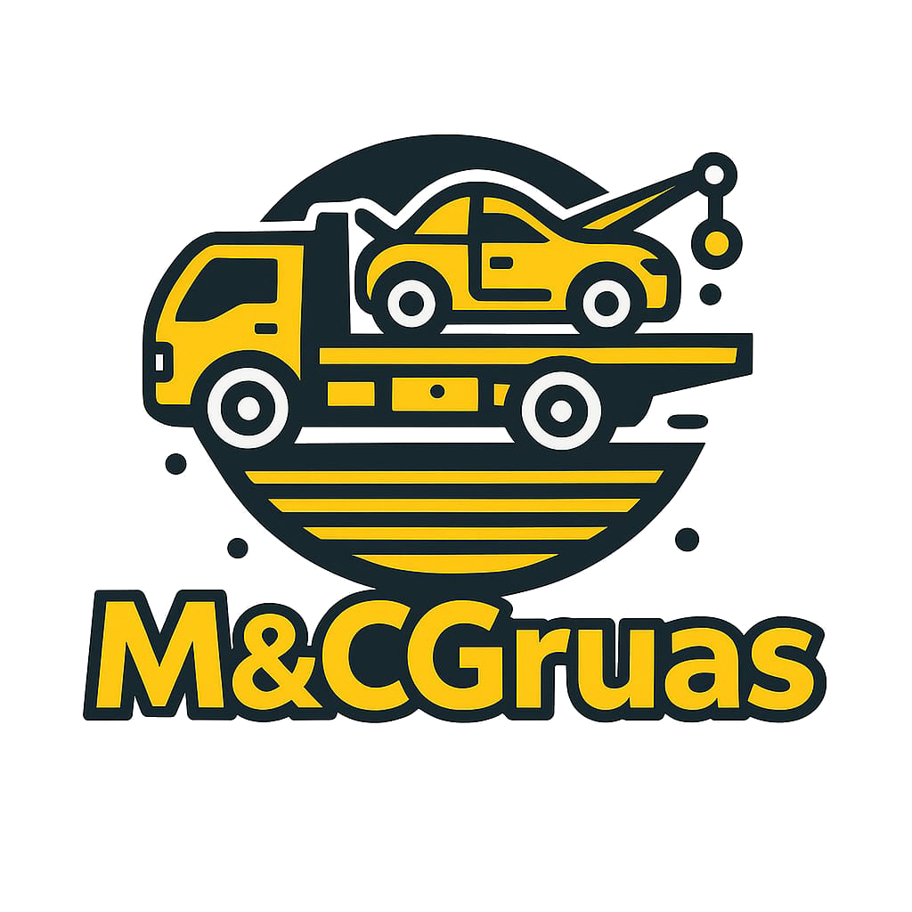
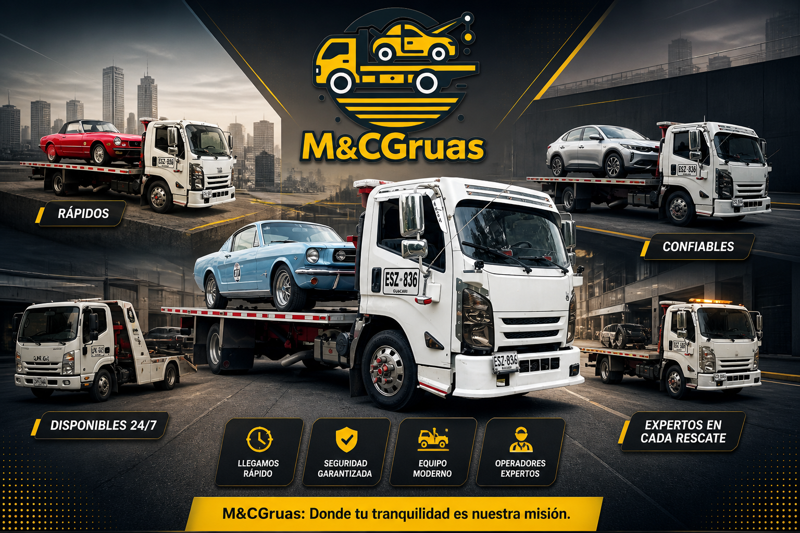

# M&C Grúas



Sitio web oficial de `M&C Grúas`, creado para presentar el servicio de grúas, recibir solicitudes de contacto y mostrar confianza comercial mediante flota, redes sociales, galería de servicios y opiniones autorizadas.

El sitio está enfocado en atención desde `Cali` y rutas principales:

`Cali - Bogotá` | `Bogotá - Cali` | `Cali - Pasto` | `Pasto - Cali`

## Vista General



La página está preparada para producción en `https://mycgruas.com/` y funciona como sitio estático con HTML, CSS, JavaScript y archivos JSON para administrar contenido sin tocar directamente el HTML.

## Páginas

- `index.html`: página principal con servicios, rutas, guía útil, galería y contacto.
- `flota.html`: flota, datos empresariales, NIT y respaldo operativo.
- `redes.html`: perfiles sociales, TikTok oficial y galería de servicios recientes.
- `experiencia.html`: formulario de satisfacción, privacidad y opiniones autorizadas.

## Funcionalidades

- Llamadas rápidas por teléfono y WhatsApp.
- Formularios con envío mediante Formspree.
- Galería principal cargada desde JSON.
- Galería de servicios recientes cargada desde JSON.
- Flota y datos de empresa administrables desde JSON.
- Redes sociales administrables desde JSON.
- Opiniones publicadas con moderación manual.
- Diseño responsive priorizado para móviles.
- SEO base con `robots.txt`, `sitemap.xml`, metadatos y schema de negocio local.

## Estructura Principal

```text
MCgruas/
├── index.html
├── flota.html
├── redes.html
├── experiencia.html
├── robots.txt
├── sitemap.xml
├── assets/
│   ├── css/
│   ├── js/
│   ├── data/
│   ├── img/
│   ├── ImgGruas/
│   └── servicios-recientes/
└── docs/
```

## Documentación

- [Uso de la plataforma](docs/USO_PLATAFORMA.md)
- [Gestión de contenido y JSON](docs/GESTION_CONTENIDO.md)

## Archivos Dinámicos

- `assets/data/galeria.json`: galería principal.
- `assets/data/servicios-recientes.json`: galería visual de redes.
- `assets/data/flota.json`: datos de empresa y vehículos.
- `assets/data/redes.json`: canales sociales y destacados.
- `assets/data/testimonios.json`: opiniones autorizadas para publicar.

## Reglas Antes de Publicar

- Verificar que los teléfonos y WhatsApp estén correctos.
- Confirmar que `assets/data/flota.json` tenga el NIT oficial.
- Revisar que las rutas visibles sigan siendo las rutas reales del negocio.
- Validar que cada imagen agregada exista en la carpeta indicada.
- Publicar solo testimonios reales y autorizados.
- Probar la home y páginas internas desde celular.

## Datos Actuales

- Empresa: `M&C Grúas`
- NIT: `1.130.664.917`
- Correo: `gruamcgruas@gmail.com`
- Teléfonos: `317 713 7402` y `316 649 3568`
- TikTok: `@mcgruas7`

## Nota de Mantenimiento

El proyecto está diseñado para que una persona pueda actualizar imágenes, redes, flota y testimonios editando archivos JSON. Si se modifica la estructura de los JSON, también se debe revisar `assets/js/scripts.js`, porque allí se renderiza el contenido dinámico.
